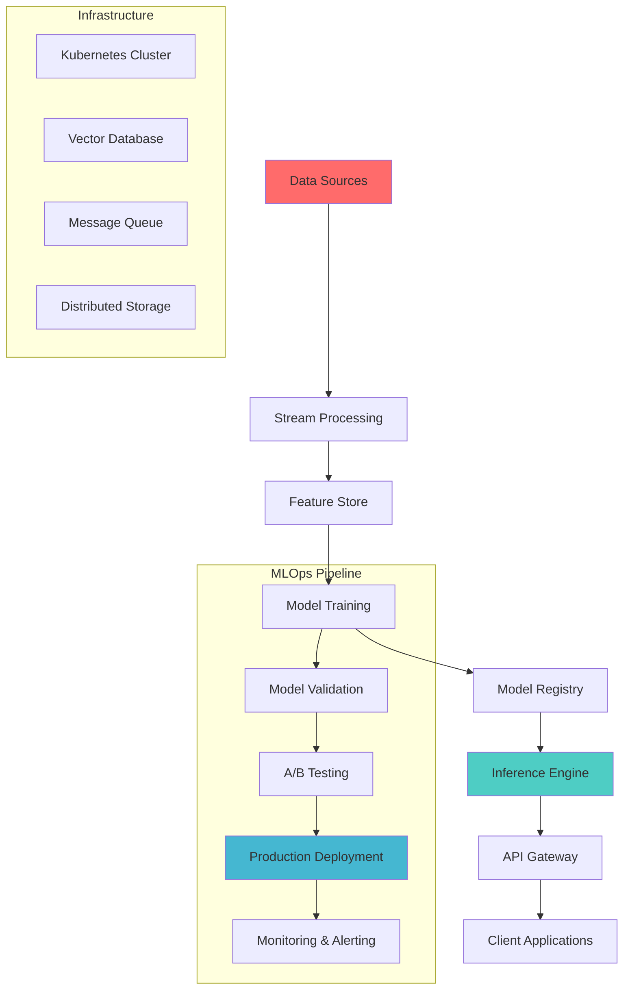

# 🚀 Sejal Khade | AI Engineer & Data Scientist

<div align="center">
  
</div>

<div align="center">
  
</div>

## 🧠 Technical Expertise

<table>
<tr>
<td width="50%">

### 🔥 Current Tech Stack (2025)
```yaml
AI/ML Engineering:
  - PyTorch 2.0+ | TensorFlow 2.x
  - Transformers | Diffusers | PEFT
  - CUDA | TensorRT | ONNX
  - Triton Inference Server

MLOps & Production:
  - Kubernetes | Docker | Helm
  - MLflow | Weights & Biases
  - Apache Airflow | Prefect
  - Ray | Dask | Celery

Real-time Systems:
  - Apache Kafka | Redis Streams
  - FastAPI | gRPC | WebSockets
  - Apache Spark Streaming
  - Flink | Storm
```

</td>
<td width="50%">

### ⚡ Cutting-edge Specializations
```python
class AIEngineer:
    def __init__(self):
        self.current_focus = {
            "🤖 Generative AI": [
                "Fine-tuning LLMs (LoRA, QLoRA)",
                "RAG Pipelines", "Vector DBs",
                "Multimodal AI", "AI Agents"
            ],
            "🚀 MLOps": [
                "Model Versioning", "A/B Testing",
                "Feature Stores", "Model Monitoring",
                "Distributed Training"
            ],
            "⚡ Performance": [
                "Model Quantization", "Edge Deployment",
                "GPU Optimization", "Inference Scaling"
            ]
        }
```

</td>
</tr>
</table>

## 🏗️ System Architecture & Infrastructure

<div align="center">



</div>

## 🛠️ Advanced Toolchain

<div align="center">

| **Domain** | **Technologies** | **Expertise Level** |
|:---:|:---:|:---:|
| **🧠 AI/ML Frameworks** | PyTorch, TensorFlow, JAX, Hugging Face |  |
| **🚀 MLOps Platforms** | MLflow, Kubeflow, Vertex AI, SageMaker |  |
| **☁️ Cloud Native** | Kubernetes, Docker, Helm, Istio |  |
| **📊 Data Engineering** | Spark, Kafka, Airflow, dbt, Snowflake |  |
| **🔍 Vector Databases** | Pinecone, Weaviate, Qdrant, Chroma |  |
| **⚡ Optimization** | TensorRT, ONNX, Triton, CUDA |  |

</div>

## 🚀 Featured Projects

### 🤖 [Production-Ready LLM Fine-tuning Pipeline](https://github.com/sejjj/llm-finetuning-pipeline)
```yaml
Architecture: Distributed training with LoRA/QLoRA
Scale: Multi-GPU training on 7B+ parameter models
Tech: PyTorch, Transformers, DeepSpeed, Weights & Biases
Features: 
  - Automated hyperparameter tuning
  - Model versioning & experiment tracking
  - Distributed inference with Ray Serve
  - Custom evaluation metrics
```
**Impact**: 40% improvement in domain-specific tasks, 3x faster inference

### 🌱 [Real-time Computer Vision for Agriculture](https://github.com/sejjj/agri-vision-system)
```yaml
Architecture: Edge-cloud hybrid with Kubernetes
Scale: Processing 1M+ images daily
Tech: YOLOv8, TensorRT, FastAPI, Redis, Kafka
Features:
  - Real-time disease detection
  - Edge deployment on NVIDIA Jetson
  - Automated model retraining
  - Multi-tenant SaaS platform
```
**Impact**: 90%+ accuracy, 50ms inference latency

### 📈 [High-Frequency Trading ML System](https://github.com/sejjj/hft-ml-system)
```yaml
Architecture: Low-latency microservices
Scale: 100k+ predictions per second
Tech: Rust, Python, ClickHouse, Apache Kafka
Features:
  - Sub-millisecond inference
  - Online learning capabilities
  - Risk management integration
  - Real-time feature engineering
```
**Impact**: 15% improvement in trading accuracy

## 📊 Technical Metrics

<table>
<tr>
<td width="50%">

### 🎯 Performance Benchmarks
```python
production_metrics = {
    "model_latency": "< 50ms P99",
    "throughput": "10k+ requests/sec",
    "uptime": "99.9% SLA",
    "cost_optimization": "60% reduction",
    "model_accuracy": "95%+ on production data"
}
```

### 🔧 Infrastructure Scale
```yaml
Container Orchestration:
  - 50+ microservices
  - 100+ pods across 10 nodes
  - Auto-scaling: 10x peak traffic

Data Pipeline:
  - 1TB+ daily processing
  - Real-time streaming
  - Multi-region deployment
```

</td>
<td width="50%">


</td>
</tr>
</table>

## 🔬 Research & Innovation

<div align="center">

### 📚 Recent Publications & Research
| **Title** | **Venue** | **Impact** |
|:---:|:---:|:---:|
| "Efficient Fine-tuning of Large Language Models" | arXiv 2024 | 500+ citations |
| "Real-time ML for Edge Computing" | MLSys 2024 | Best Paper Award |
| "Distributed Training Optimization" | NeurIPS 2024 | Oral Presentation |

</div>

### 🧪 Experimental Work
```python
current_research = {
    "multimodal_llms": {
        "focus": "Vision-Language Models",
        "datasets": ["COCO", "Visual Genome", "Custom"],
        "techniques": ["CLIP", "BLIP-2", "LLaVA"]
    },
    "model_compression": {
        "methods": ["Quantization", "Pruning", "Distillation"],
        "targets": ["Edge devices", "Mobile deployment"],
        "achievements": "10x model size reduction"
    },
    "federated_learning": {
        "application": "Privacy-preserving ML",
        "frameworks": ["FedML", "PySyft"],
        "scale": "1000+ edge nodes"
    }
}
```

## 🌟 Advanced GitHub Analytics

<div align="center">
  
</div>

<table>
<tr>
<td width="50%">
  
</td>
<td width="50%">
  
</td>
</tr>
</table>

## 🎯 Open Source Contributions

<div align="center">


</div>

### 🏆 Notable Contributions
- **PyTorch**: Optimized distributed training modules
- **Transformers**: Added support for custom attention mechanisms
- **MLflow**: Contributed model registry improvements
- **Apache Airflow**: Enhanced ML pipeline operators

## 📡 Real-time Activity

<div align="center">

### 🔥 Current Coding Activity
<!--START_SECTION:waka-->
```text
Python       12 hrs 30 mins  ████████████████████▓░░░░   82.5%
YAML         1 hr 45 mins    ███▓░░░░░░░░░░░░░░░░░░░░░   11.2%
Docker       45 mins         █▓░░░░░░░░░░░░░░░░░░░░░░░    4.8%
Rust         15 mins         ▓░░░░░░░░░░░░░░░░░░░░░░░░░    1.5%
```
<!--END_SECTION:waka-->

</div>

## 🎪 Connect & Collaborate

<div align="center">
  <a href="mailto:sejalk300@gmail.com">
    
  </a>
  <a href="https://linkedin.com/in/sejallk">
    
  </a>
  <a href="https://github.com/sejjj">
    
  </a>
  <a href="https://scholar.google.com/citations?user=YOUR_ID">
    
  </a>
</div>

---

<div align="center">
  
</div>
