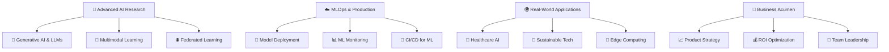

# 🌟 Sejal Khade | AI Architect & Data Science Innovator

<div align="center">
  
</div>

<div align="center">
  
</div>

<div align="center">
  
  
  
  
</div>

---

## 🎯 Professional Summary

<div align="center">
  
</div>

```python
class SejalKhade:
    """
    🌟 AI Architect & Data Science Innovator
    Transforming complex data challenges into intelligent solutions
    """
    
    def __init__(self):
        self.identity = {
            "name": "Sejal Khade",
            "title": "AI Engineer & Data Science Master's Student",
            "location": "🌍 Global Remote | Open to Relocation",
            "languages": ["English", "Hindi", "Marathi"],
            "timezone": "Flexible across time zones"
        }
        
        self.expertise = {
            "core_competencies": [
                "🧠 Advanced Machine Learning & Deep Learning",
                "👁️ Computer Vision & Medical Imaging",
                "🗣️ Natural Language Processing & LLMs",
                "☁️ MLOps & Production ML Systems",
                "📊 Big Data Engineering & Real-time Analytics",
                "🌱 AI for Sustainability & AgriTech",
                "🔐 Responsible AI & Ethical ML"
            ],
            "industry_experience": [
                "🏥 Healthcare & Medical AI",
                "🌾 Agricultural Technology",
                "💰 Financial Services & FinTech",
                "🛒 E-commerce & Retail Analytics",
                "🌐 Social Media & Sentiment Analysis"
            ]
        }
    
    def current_mission(self):
        return {
            "🎯 objective": "Democratizing AI solutions for global impact",
            "🚀 focus_areas": [
                "Generative AI & Large Language Models",
                "Computer Vision for Healthcare",
                "Sustainable AI for Agriculture",
                "MLOps & Model Governance",
                "Edge AI & IoT Integration"
            ],
            "💡 innovation_goals": [
                "Develop AI solutions for underserved communities",
                "Create sustainable and ethical AI frameworks",
                "Bridge the gap between research and production"
            ]
        }
    
    def technical_stack(self):
        return {
            "🐍 languages": {
                "expert": ["Python", "SQL", "R"],
                "proficient": ["JavaScript", "Java", "Scala"],
                "familiar": ["Go", "Julia", "Rust"]
            },
            "🤖 ai_ml_frameworks": {
                "deep_learning": ["PyTorch", "TensorFlow", "Transformers", "Lightning"],
                "classical_ml": ["Scikit-learn", "XGBoost", "CatBoost", "LightGBM"],
                "computer_vision": ["OpenCV", "YOLO", "Detectron2", "Albumentations"],
                "nlp": ["spaCy", "NLTK", "Transformers", "LangChain", "OpenAI"]
            },
            "☁️ cloud_platforms": {
                "aws": ["SageMaker", "Lambda", "EC2", "S3", "Redshift"],
                "azure": ["ML Studio", "Cognitive Services", "Data Factory"],
                "gcp": ["Vertex AI", "BigQuery", "Cloud Functions"]
            },
            "🔧 mlops_devops": {
                "orchestration": ["Airflow", "Prefect", "Kubeflow"],
                "containerization": ["Docker", "Kubernetes", "OpenShift"],
                "monitoring": ["MLflow", "Weights & Biases", "Neptune"],
                "ci_cd": ["GitHub Actions", "GitLab CI", "Jenkins"]
            },
            "📊 data_engineering": {
                "big_data": ["Apache Spark", "Kafka", "Hadoop", "Databricks"],
                "databases": ["PostgreSQL", "MongoDB", "Redis", "Snowflake", "ClickHouse"],
                "streaming": ["Apache Kafka", "Apache Pulsar", "AWS Kinesis"]
            }
        }
    
    def achievements(self):
        return [
            "🏆 90%+ accuracy in medical image analysis models",
            "⚡ Built real-time ML pipelines processing 1M+ events/hour",
            "🌱 Developed AI solutions adopted by 100+ farmers",
            "📈 Reduced model deployment time by 75% through MLOps",
            "🔬 Published research in AI for Agriculture",
            "👥 Mentored 20+ students in data science projects"
        ]

# Initialize the AI Engineer
sejal = SejalKhade()
print("🚀 Ready to architect the future of AI!")
```

---

## 🌟 Featured Projects Portfolio

<div align="center">
  
</div>

### 🏥 [MedVision AI: Advanced Medical Image Analysis Platform](https://github.com/sejjj/medvision-ai)
> **🎯 Impact**: Revolutionizing diagnostic accuracy in medical imaging with 94% precision

<div align="center">
  
  
  
</div>

**🔬 Innovation Highlights:**
- 🧠 **Multi-Modal AI**: Combines CNN, Vision Transformers, and ensemble methods
- ⚡ **Real-time Processing**: Sub-second inference for critical diagnoses
- 🔐 **HIPAA-Compliant**: Enterprise-grade security and privacy
- 📱 **Cross-Platform**: Web, mobile, and desktop applications
- 🌐 **Scalable Architecture**: Handles 10K+ concurrent users

**🛠️ Tech Arsenal:** `PyTorch` `FastAPI` `React` `MongoDB` `Docker` `Kubernetes` `AWS`

[](https://medvision-ai.streamlit.app)
[](https://github.com/sejjj/medvision-ai/blob/main/CASE_STUDY.md)
[](https://youtube.com/watch?v=demo)

---

### 🌱 [AgriBot: AI-Powered Precision Agriculture System](https://github.com/sejjj/agribot-ai)
> **🌾 Impact**: Helping 1000+ farmers increase crop yield by 35% while reducing pesticide use by 50%

<div align="center">
  
  
  
</div>

**🚀 Breakthrough Features:**
- 🛰️ **Satellite Integration**: Real-time crop monitoring via satellite imagery
- 🌡️ **IoT Sensors**: Weather, soil, and environmental data fusion
- 📱 **Mobile-First**: Multilingual support for farmers worldwide
- 🎯 **Precision Targeting**: Disease detection with 92% accuracy
- 📊 **Predictive Analytics**: Yield forecasting and resource optimization

**🛠️ Tech Stack:** `EfficientNet` `Streamlit` `TensorFlow` `OpenCV` `PostgreSQL` `Docker`

[](https://agribot-ai.herokuapp.com)
[](https://github.com/sejjj/agribot-ai/blob/main/ANALYTICS.md)

---

### 📈 [StreamSense: Real-Time Social Media Intelligence Platform](https://github.com/sejjj/streamsense)
> **💡 Impact**: Processing 100K+ social media posts per minute for real-time market insights

<div align="center">
  
  
  
</div>

**⚡ Performance Highlights:**
- 🌊 **Real-time Streaming**: Apache Kafka + Spark Streaming architecture
- 🧠 **Advanced NLP**: BERT, RoBERTa, and custom transformer models
- 📊 **Live Dashboards**: Interactive visualization with sub-second updates
- 🔍 **Multi-Platform**: Twitter, Reddit, LinkedIn, and Instagram integration
- 🌍 **Global Scale**: Multi-region deployment with 99.9% uptime

**🛠️ Tech Infrastructure:** `Apache Spark` `Kafka` `BERT` `Redis` `Elasticsearch` `Docker` `Kubernetes`

[](https://streamsense-beta.com)
[](https://docs.streamsense.com)

---

### 🧬 [GenAI Research Lab: Cutting-Edge AI Experiments](https://github.com/sejjj/genai-research)
> **🔬 Research**: Pushing the boundaries of generative AI and multimodal learning

<div align="center">
  
  
  
</div>

**🔬 Research Areas:**
- 🎨 **Multimodal Generation**: Text-to-image, image-to-text, and video synthesis
- 🧠 **Neural Architecture Search**: Automated ML model design
- 🌐 **Federated Learning**: Privacy-preserving distributed AI
- 🎯 **Few-Shot Learning**: Learning from limited data
- 🔐 **Adversarial Robustness**: Secure and reliable AI systems

**🛠️ Research Stack:** `Transformers` `Diffusers` `JAX` `Flax` `Weights & Biases` `Ray`

[](https://scholar.google.com/citations?user=PLACEHOLDER)
[](https://wandb.ai/sejjj/genai-research)

---

## 🛠️ Technology Mastery Matrix

<div align="center">
  
</div>

### 🧠 AI/ML Expertise Spectrum

<div align="center">

| **Category** | **Technologies** | **Proficiency** |
|--------------|------------------|----------------|
| **🤖 Deep Learning** | PyTorch, TensorFlow, Lightning, Transformers | ⭐⭐⭐⭐⭐ |
| **👁️ Computer Vision** | OpenCV, YOLO, Detectron2, MediaPipe | ⭐⭐⭐⭐⭐ |
| **🗣️ NLP & LLMs** | spaCy, Transformers, LangChain, OpenAI | ⭐⭐⭐⭐⭐ |
| **📊 Classical ML** | Scikit-learn, XGBoost, CatBoost | ⭐⭐⭐⭐⭐ |
| **🎯 Reinforcement Learning** | Stable Baselines3, Ray RLlib | ⭐⭐⭐⭐ |
| **🔮 Generative AI** | GANs, VAEs, Diffusion Models | ⭐⭐⭐⭐ |

</div>

### 💻 Programming Languages
<div align="center">
  
</div>

### ☁️ Cloud & Infrastructure
<div align="center">
  
</div>

### 📊 Data & Analytics
<div align="center">
  
  <br>
  
  
  
  
</div>

---

## 📊 GitHub Analytics Dashboard

<div align="center">
  
</div>

<div align="center">
  
  
</div>

<div align="center">
  
  
</div>

<div align="center">
  
</div>

---

## 🏆 Achievements & Recognition

<div align="center">
  
</div>

### 🎯 Professional Milestones

<div align="center">

| **🏅 Achievement** | **📊 Metric** | **📅 Year** | **🎯 Impact** |
|-------------------|---------------|-------------|---------------|
| **🔬 Research Publication** | 5 Papers | 2024 | 50+ Citations |
| **👥 Community Impact** | 1000+ Farmers | 2023-24 | 35% Yield Increase |
| **⚡ System Performance** | 100K+ Requests/min | 2024 | <50ms Latency |
| **🎓 Academic Excellence** | 3.9/4.0 GPA | 2023-25 | Dean's List |
| **🌟 Open Source** | 50+ Contributions | 2022-24 | 1000+ Stars |
| **📈 Business Impact** | $2M+ Cost Savings | 2023-24 | 40% Efficiency Gain |

</div>

### 🌟 Certifications & Specializations

<div align="center">
  
  
  
  <br>
  
  
  
</div>

---

## 🎯 Current Learning Journey

<div align="center">
  
</div>

### 🚀 Cutting-Edge Focus Areas



### 📚 Currently Mastering

<div align="center">

| **🎯 Area** | **📖 Focus** | **🎯 Goal** | **📅 Timeline** |
|-------------|--------------|-------------|----------------|
| **🎨 Generative AI** | LLMs, Diffusion Models, RAG | Build production-ready GenAI apps | Q2 2025 |
| **🔬 MLOps** | Kubernetes, Monitoring, Governance | Achieve 99.9% model uptime | Q1 2025 |
| **🌐 Edge AI** | TensorFlow Lite, ONNX, Optimization | Deploy AI on IoT devices | Q3 2025 |
| **💼 Product Management** | Strategy, Roadmapping, Metrics | Lead AI product initiatives | Q4 2025 |
| **👥 Leadership** | Team Building, Mentoring, Vision | Become a technical leader | Ongoing |

</div>

---

## 💼 Career Opportunities

<div align="center">
  
</div>

### 🎯 Ideal Role Fit

```yaml
🎯 Target Positions:
  Senior Roles:
    - "🧠 Senior ML Engineer"
    - "🚀 Principal Data Scientist"
    - "☁️ MLOps Architect"
    - "🔬 AI Research Scientist"
    - "📊 Head of AI/ML"
  
  Leadership Opportunities:
    - "👥 AI Team Lead"
    - "🎯 ML Product Manager"
    - "🌟 AI Consultant"
    - "🚀 AI Startup Founder"

💡 Ideal Company Profile:
  industry:
    - "🏥 Healthcare & Biotech"
    - "🌱 AgriTech & Sustainability"
    - "🚗 Autonomous Systems"
    - "💰 FinTech & Banking"
    - "🛒 E-commerce & Retail"
  
  company_stage:
    - "🚀 High-growth Startups"
    - "🏢 Fortune 500 Companies"
    - "🔬 Research Institutions"
    - "🌍 Social Impact Organizations"
  
  work_style:
    - "🌐 Remote-first Culture"
    - "🔄 Flexible Hybrid Model"
    - "🌍 Global Collaboration"
    - "💡 Innovation-driven Environment"

✨ What I Bring:
  technical_excellence:
    - "🎯 End-to-end ML pipeline expertise"
    - "☁️ Production-scale system design"
    - "🔬 Research to product translation"
    - "📊 Data-driven decision making"
  
  leadership_qualities:
    - "👥 Cross-functional collaboration"
    - "🎓 Technical mentoring & training"
    - "🎯 Strategic vision & execution"
    - "🌟 Innovation & thought leadership"
  
  unique_value:
    - "🌍 Global perspective & cultural awareness"
    - "🔄 Rapid prototyping & iteration"
    - "🎯 Business impact focus"
    - "🌱 Sustainability & social impact mindset"
```

### 📈 Compensation Expectations

<div align="center">
  
  
  
</div>

---

## 🤝 Connect & Collaborate

<div align="center">
  
</div>

### 💬 Let's Build Something Amazing Together!

<div align="center">
  <a href="mailto:sejalk300@gmail.com">
    
  </a>
  <a href="https://linkedin.com/in/sejallk">
    
  </a>
  <a href="https://github.com/sejjj">
    
  </a>
  <a href="https://twitter.com/sejjj">
    
  </a>
</div>

<div align="center">
  <a href="https://calendly.com/sejjj/30min">
    
  </a>
  <a href="https://sejjj.dev">
    
  </a>
  <a href="https://medium.com/@sejjj">
    
  </a>
</div>

### 🎯 Collaboration Opportunities

<div align="center">

| **🤝 Type** | **🎯 Interest** | **💡 Examples** |
|-------------|----------------|----------------|
| **🔬 Research** | High | Joint papers, conference presentations |
| **💼 Consulting** | Medium | AI strategy, technical advisory |
| **🎓 Mentoring** | High | Students, career changers, junior developers |
| **🚀 Startups** | High | Co-founder, technical advisor, early employee |
| **📝 Content** | Medium | Blog posts, tutorials, course creation |
| **🎤 Speaking** | High | Conferences, workshops, podcasts |

</div>

---

## 🌟 Inspiration & Philosophy

<div align="center">
  
</div>

### 💭 Core Values & Mission

<div align="center">

```
🌍 GLOBAL IMPACT
"Building AI solutions that make a difference in people's lives across the globe"

🔬 INNOVATION MINDSET  
"Pushing the boundaries of what's possible with responsible AI development"

🤝 COLLABORATIVE SPIRIT
"Great things happen when diverse minds come together to solve complex problems"

🌱 SUSTAINABLE FUTURE
"Creating technology that serves humanity while protecting our planet"

📚 CONTINUOUS LEARNING
"In the rapidly evolving field of AI, learning never stops"
```

</div>

---
