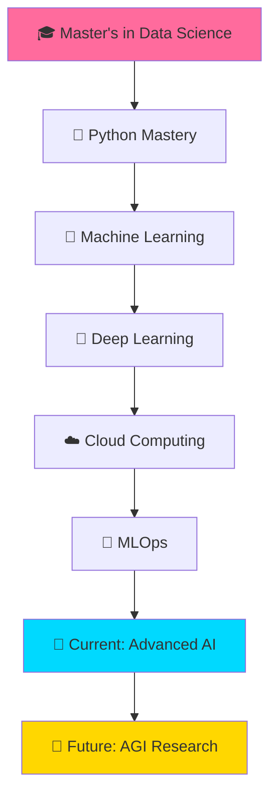

# 🌟 Hey there! I'm Sejal Khade

<div align="center">
  
</div>

<div align="center">
  
</div>

<p align="center">
  
  
  
</p>

---

## 🎭 Who Am I?

<table>
<tr>
<td width="50%">

```python
#!/usr/bin/env python3
# -*- coding: utf-8 -*-

class DataWizard:
    def __init__(self):
        self.name = "Sejal Khade"
        self.role = "Data Science Magician 🧙‍♀️"
        self.location = "🌍 Remote | Hybrid | On-site"
        self.education = "Master's in Data Science"
        self.superpower = "Turning messy data into gold ✨"
        self.coffee_consumption = "∞ cups/day ☕"
        
    def get_current_mission(self):
        return {
            "🎯 Focus": "AI-powered solutions for real problems",
            "🚀 Goal": "Making AI accessible to everyone",
            "💡 Vision": "Data-driven world transformation",
            "🌱 Learning": "Never stop growing!"
        }
    
    def skills_arsenal(self):
        return {
            "🐍 Python": "Advanced",
            "📊 ML/DL": "Expert", 
            "☁️ Cloud": "Proficient",
            "🔧 MLOps": "Intermediate",
            "🎨 Visualization": "Creative"
        }

# Initialize the magic
sejal = DataWizard()
print("🚀 Ready to revolutionize the world with data!")
```

</td>
<td width="50%">

### 🌟 Current Adventures

- 🧠 **Deep Learning Architectures** - Building smarter models
- 🌱 **AI for Agriculture** - Helping farmers with technology  
- 📈 **Real-time Analytics** - Processing data at lightning speed
- 🤖 **Computer Vision** - Teaching machines to see
- 🔮 **Generative AI** - Creating the impossible

### 🎯 Dream Projects

- 🌍 **Climate Change Solutions** using satellite data
- 🏥 **Healthcare AI** for early disease detection
- 🎓 **Educational AI** for personalized learning
- 🌾 **Smart Agriculture** for sustainable farming

### 🎉 Fun Facts

- 🎨 Digital art enthusiast
- 📚 Tech blog addict
- 🌱 Weekend gardener
- 🧩 Puzzle solver
- 🎵 Music lover

</td>
</tr>
</table>

---

## 🔥 Featured Projects

<div align="center">
  
</div>

<table>
<tr>
<td width="50%">

### 🌱 [Cocoa Leaf Disease AI Doctor](https://github.com/sejjj/cocoa-leaf-disease-detection)


**✨ What makes it special:**
- 🎯 **90%+ accuracy** - EfficientNetB0 powered
- 📱 **Mobile-first design** - Works on any device
- ⚡ **Real-time analysis** - Instant results
- 📊 **Smart reports** - PDF generation included
- 🐳 **Docker ready** - Deploy anywhere

**🛠️ Built with:** `PyTorch` `Streamlit` `OpenCV` `Docker`

</td>
<td width="50%">

### 📊 [Twitter Sentiment Storm](https://github.com/sejjj/twitter-sentiment-streaming)


**⚡ Real-time sentiment analysis at scale:**
- 🌊 **10K+ tweets/minute** processing power
- 🧠 **BERT-powered** sentiment understanding
- 📈 **Live dashboards** for instant insights  
- ☁️ **Auto-scaling** cloud architecture
- 🔥 **Kafka streaming** for high throughput

**🛠️ Built with:** `Apache Spark` `Kafka` `BERT` `AWS`

</td>
</tr>
</table>

<div align="center">
  
[](https://github.com/sejjj?tab=repositories)

</div>

---

## 🎨 Tech Stack Universe

<div align="center">
  
</div>

<table>
<tr>
<td align="center" width="25%">

**🐍 Languages**
<br><br>

<br>


</td>
<td align="center" width="25%">

**🤖 AI/ML**
<br><br>

<br>


</td>
<td align="center" width="25%">

**☁️ Cloud**
<br><br>

<br>


</td>
<td align="center" width="25%">

**🗄️ Databases**
<br><br>

<br>


</td>
</tr>
</table>

### 🔧 Advanced Toolkit

<div align="center">

| **Category** | **Technologies** |
|:---:|:---:|
| **🧠 ML Frameworks** | `PyTorch` `TensorFlow` `Scikit-learn` `XGBoost` `LightGBM` |
| **📊 Data Processing** | `Pandas` `NumPy` `Apache Spark` `Dask` `Polars` |
| **🌊 Streaming** | `Apache Kafka` `Apache Flink` `Redis Streams` |
| **📈 Visualization** | `Plotly` `Matplotlib` `Seaborn` `Tableau` `Power BI` |
| **🚀 MLOps** | `MLflow` `Kubeflow` `DVC` `Weights & Biases` |
| **🔧 DevOps** | `Docker` `Kubernetes` `GitHub Actions` `Jenkins` |

</div>

---

## 📊 GitHub Universe

<div align="center">
  
</div>

<table>
<tr>
<td width="50%">
  
</td>
<td width="50%">
  
</td>
</tr>
</table>

<div align="center">
  
</div>

<div align="center">
  
</div>

---

## 🚀 Contribution Graph

<div align="center">
  
</div>

---

## 🎯 Learning Journey

<div align="center">
  
</div>



### 🌟 Currently Mastering

<table>
<tr>
<td width="33%" align="center">
  
  <br><strong>🤖 Generative AI</strong>
  <br>LLMs, RAG, Fine-tuning
</td>
<td width="33%" align="center">
  
  <br><strong>🌊 Real-time ML</strong>
  <br>Streaming, Edge Computing
</td>
<td width="33%" align="center">
  
  <br><strong>🔬 Research</strong>
  <br>Novel Architectures, Papers
</td>
</tr>
</table>

---

## 💼 Dream Opportunities

<div align="center">
  
</div>

<table>
<tr>
<td width="50%">

### 🎯 Ideal Roles
- 🧪 **AI Research Scientist**
- 🤖 **Senior ML Engineer** 
- 📊 **Principal Data Scientist**
- 🚀 **MLOps Architect**
- 🌟 **AI Product Manager**

</td>
<td width="50%">

### 🌈 Perfect Environment
- 🌍 **Remote-first culture**
- 🚀 **Innovation-driven**
- 🤝 **Collaborative teams**
- 📈 **Growth opportunities**
- 🌱 **Social impact focus**

</td>
</tr>
</table>

---

## 🌐 Let's Connect & Create Magic

<div align="center">
  
</div>

<p align="center">
  <a href="mailto:sejalk300@gmail.com">
    
  </a>
  <a href="https://linkedin.com/in/sejallk">
    
  </a>
  <a href="https://github.com/sejjj">
    
  </a>
  <a href="https://twitter.com/yourusername">
    
  </a>
</p>

---

## 🎪 Fun Zone

<div align="center">
  
</div>

<div align="center">
  
### 🎵 Currently Coding To
[](https://spotify-github-profile.vercel.app/api/view?uid=yourspotifyid&redirect=true)

</div>

---

<div align="center">
  
  <br>
  <em>"Data is the new oil, but AI is the refinery that turns it into gold." ✨</em>
  <br><br>
  
</div>
