#  Hey there! I'm Sejal Khade

<div align="center">
  
  [](https://git.io/typing-svg)
  
  <p align="center">
    
    
    
  </p>
  
</div>

---

## 🚀 What I'm Building Right Now

<table>
<tr>
<td width="50%">

### 🌱 [Cocoa Leaf Disease Detector](https://github.com/sejjj/cocoa-leaf-disease-detection)
> **AI-Powered Agricultural Solution**

```python
# Tech Stack Highlights
stack = {
    "AI/ML": ["EfficientNetB0", "PyTorch", "Computer Vision"],
    "Frontend": ["Streamlit", "Custom CSS", "Responsive Design"],
    "Features": ["Real-time Analysis", "PDF Reports", "Batch Processing"],
    "Impact": "Helping farmers prevent crop losses 🌾"
}
```

</td>
<td width="50%">

### 🐦 [Real-Time Twitter Sentiment Analysis](https://github.com/sejjj/twitter-sentiment-streaming)
> **Big Data Streaming Pipeline**

```python
# Architecture Overview
pipeline = {
    "Streaming": ["Apache Spark", "Kafka"],
    "ML": ["BERT", "Transformer Models"],
    "Visualization": ["Real-time Dashboards"],
    "Scale": "Processing millions of tweets/hour 📊"
}
```

</td>
</tr>
</table>

---

## 🎯 2025 Learning Journey

```mermaid
graph LR
    A[🔥 Current Focus] --> B[MLOps & DevOps]
    A --> C[Big Data Engineering]
    A --> D[Advanced AI/ML]
    
    B --> B1[Docker & Kubernetes]
    B --> B2[CI/CD Pipelines]
    B --> B3[Model Deployment]
    
    C --> C1[Apache Spark]
    C --> C2[Data Lakes]
    C --> C3[Stream Processing]
    
    D --> D1[Transformer Models]
    D --> D2[Computer Vision]
    D --> D3[Reinforcement Learning]
```

<div align="center">



</div>

<p align="center">
  
  
  
  
  
</p>

---

## 💡 Tech Arsenal

<details>
<summary>🔧 <b>Click to expand my tech stack</b></summary>

### Languages & Core Technologies
<p>
  
  
  
  
</p>

### AI/ML & Data Science
<p>
  
  
  
  
  
  
</p>

### Cloud & DevOps
<p>
  
  
  
  
</p>

### Databases & Big Data
<p>
  
  
  
  
</p>

### Visualization & BI
<p>
  
  
  
  
</p>

</details>

---

## 📊 GitHub Analytics

<div align="center">
  
  
  
  
</div>

<div align="center">
  
  
  
</div>

<div align="center">
  
  
  
</div>

---

## 🏆 Achievements & Certifications

<div align="center">
  
  
  
</div>

<table align="center">
<tr>
<td align="center" width="33%">

### 🎯 Machine Learning
- **Deep Learning Specialization**
- **MLOps Engineering**
- **Computer Vision Expert**

</td>
<td align="center" width="33%">

### 📊 Data Engineering
- **Big Data Analytics**
- **Spark Certified Developer**
- **Cloud Architecture**

</td>
<td align="center" width="33%">

### 🚀 Leadership
- **Open Source Contributor**
- **Tech Community Leader**
- **Mentor & Speaker**

</td>
</tr>
</table>

---

## 🤝 Let's Connect & Collaborate!

<div align="center">

### 💬 Open for Discussions About:
`Machine Learning` • `Deep Learning` • `MLOps` • `Data Engineering` • `Computer Vision` • `NLP` • `Big Data` • `Cloud Computing`

<p>
  <a href="mailto:sejalk300@gmail.com">
    
  </a>
  <a href="https://linkedin.com/in/sejallk">
    
  </a>
  <a href="https://github.com/sejjj">
    
  </a>
  <a href="https://twitter.com/sejjj">
    
  </a>
</p>

</div>

---

<div align="center">

### 🎭 Daily Motivation


### 💭 Fun Fact of the Day
> "I speak fluent Python, but I'm still learning to communicate with humans! 🐍😄"


---

<p align="center">
  <i>⭐️ From <a href="https://github.com/sejjj">sejjj</a> | Building the future, one algorithm at a time</i>
</p>

</div>
