# 🚀 Sejal Khade | AI Engineer & Data Scientist

<div align="center">
  
</div>

<div align="center">
  
</div>

<p align="center">
  
  
  
  
</p>

---

## 🧬 Digital DNA

<table>
<tr>
<td width="60%">

```python
class AIEngineer:
    def __init__(self):
        self.name = "Sejal Khade"
        self.expertise = ["Generative AI", "LLM Fine-tuning", "Computer Vision", "MLOps"]
        self.current_focus = "Building production-ready AI systems"
        self.tech_philosophy = "Code is poetry, AI is magic ✨"
        
    async def current_stack(self):
        return {
            "🧠 AI/ML": {
                "frameworks": ["PyTorch 2.0+", "Transformers 🤗", "LangChain", "OpenAI API"],
                "specialties": ["LLM Fine-tuning", "RAG Systems", "Multi-modal AI"],
                "models": ["Llama 2/3", "GPT-4", "Claude", "Mistral", "Gemini"]
            },
            "⚡ Performance": {
                "optimization": ["CUDA", "TensorRT", "ONNX", "Quantization"],
                "deployment": ["FastAPI", "Docker", "Kubernetes", "Serverless"],
                "monitoring": ["MLflow", "Weights & Biases", "Prometheus"]
            },
            "🌐 Cloud & Infrastructure": {
                "platforms": ["AWS", "Azure", "GCP", "Vercel", "Hugging Face"],
                "services": ["SageMaker", "Vertex AI", "Azure ML", "Lambda"],
                "databases": ["Vector DBs", "PostgreSQL", "Redis", "Neo4j"]
            }
        }
    
    def get_2025_focus(self):
        return [
            "🔬 Multimodal AI (Vision + Language + Audio)",
            "🚀 Edge AI & Mobile Deployment", 
            "🔐 AI Safety & Alignment",
            "⚡ Real-time AI Inference",
            "🌍 Sustainable AI Computing"
        ]

# Initialize
ai_engineer = AIEngineer()
print("🚀 Ready to revolutionize AI in 2025!")
```

</td>
<td width="40%">

### 🎯 **2025 Tech Focus**

```yaml
Current_Projects:
  - name: "Multimodal RAG System"
    tech: ["LangChain", "CLIP", "Whisper"]
    status: "Production Ready"
    
  - name: "Edge AI Deployment"
    tech: ["TensorRT", "ONNX", "EdgeTPU"]
    status: "Optimizing"
    
  - name: "LLM Fine-tuning Pipeline"
    tech: ["LoRA", "QLoRA", "PEFT"]
    status: "Scaling"

Learning_Queue:
  - "🧠 Mixture of Experts (MoE)"
  - "🔄 Retrieval Augmented Generation 2.0"
  - "⚡ Speculative Decoding"
  - "🎭 Constitutional AI"
  - "🌊 Continuous Learning Systems"

Certifications:
  - "☁️ AWS ML Specialty"
  - "🤖 Google Cloud ML Engineer"
  - "📊 Azure AI Engineer"
  - "🏆 NVIDIA DLI Certified"
```

</td>
</tr>
</table>

---

## 🔥 **Flagship Projects 2025**

<div align="center">
  
</div>

### 🚀 **1. Multimodal AI Assistant** | *Production-Grade*

```mermaid
graph TB
    A[📱 User Input] --> B{Input Type?}
    B -->|Text| C[🧠 LLM Processing]
    B -->|Image| D[👁️ Vision Model]
    B -->|Audio| E[👂 Speech-to-Text]
    C --> F[🔄 Multimodal Fusion]
    D --> F
    E --> F
    F --> G[📊 Context Analysis]
    G --> H[⚡ Response Generation]
    H --> I[📤 Optimized Output]
```

<details>
<summary>🔍 <strong>Click to explore the future of AI interaction</strong></summary>



**🛠️ Tech Arsenal:**
- **Models**: `Llama 3.1`, `CLIP`, `Whisper v3`, `GPT-4V`
- **Framework**: `LangChain`, `Transformers`, `FastAPI`
- **Deployment**: `Docker`, `Kubernetes`, `AWS ECS`
- **Performance**: `TensorRT`, `ONNX Runtime`, `Flash Attention`

**📊 Metrics:**
- ⚡ **Latency**: <200ms response time
- 🎯 **Accuracy**: 94% on multimodal tasks
- 📈 **Scalability**: 1000+ concurrent users
- 💰 **Cost**: 70% reduction vs GPT-4 API
</details>

### 🌱 **2. Smart Agriculture AI Platform** | *Real-world Impact*
<details>
<summary>🌾 <strong>Revolutionizing farming with Computer Vision</strong></summary>

**🎯 Problem Solved**: Early crop disease detection saving 40% of global harvest losses

```python
# Real-time disease detection pipeline
class CropHealthAI:
    def __init__(self):
        self.models = {
            'disease_detector': EfficientNetV2(),
            'growth_analyzer': YOLOv8(),
            'health_predictor': TransformerModel()
        }
        self.accuracy = 0.96
        self.processing_time = "< 100ms"
    
    async def analyze_crop(self, image_data):
        # Multi-stage analysis pipeline
        diseases = await self.detect_diseases(image_data)
        growth_stage = await self.analyze_growth(image_data)
        recommendations = await self.generate_insights(diseases, growth_stage)
        return recommendations
```

**🔬 Technical Highlights:**
- **Custom Dataset**: 100K+ annotated crop images
- **Edge Deployment**: Raspberry Pi + Coral TPU
- **Real-time Processing**: WebRTC streaming
- **Mobile App**: React Native + TensorFlow Lite
</details>

### ⚡ **3. Real-time Sentiment Analysis Engine** | *Enterprise Scale*
<details>
<summary>📊 <strong>Processing millions of data points per second</strong></summary>

**🏗️ Architecture:**
```
Data Sources → Kafka → Spark Streaming → ML Models → Real-time Dashboard
    ↓              ↓           ↓            ↓              ↓
Twitter API   Message Queue  GPU Cluster  BERT/RoBERTa   React App
Reddit API    Load Balancer  Auto-scaling Sentiment AI   WebSocket
News APIs     Data Pipeline  Model Serving Custom Models Live Updates
```

**🚀 Performance Metrics:**
- **Throughput**: 50K+ messages/second
- **Latency**: <50ms end-to-end
- **Accuracy**: 97.3% sentiment classification
- **Uptime**: 99.99% availability
- **Cost**: 80% cheaper than cloud solutions
</details>

---

## 🧠 **AI/ML Tech Stack 2025**

<div align="center">
  
</div>

<table>
<tr>
<td align="center" width="20%">

**🤖 LLMs & Gen AI**
<br><br>


</td>
<td align="center" width="20%">

**⚡ ML Frameworks**
<br><br>


</td>
<td align="center" width="20%">

**🚀 MLOps & Deploy**
<br><br>


</td>
<td align="center" width="20%">

**☁️ Cloud & Data**
<br><br>


</td>
<td align="center" width="20%">

**🎯 Specialized AI**
<br><br>


</td>
</tr>
</table>

### 🔬 **Cutting-Edge Technologies I'm Working With**

<div align="center">

| **🧠 AI/ML** | **⚡ Performance** | **🔧 Tools** | **📊 Data** |
|:---:|:---:|:---:|:---:|
| `Transformers` | `CUDA 12.0+` | `Weights & Biases` | `Apache Iceberg` |
| `LangChain` | `TensorRT 8.6` | `MLflow 2.0` | `Delta Lake` |
| `LlamaIndex` | `Flash Attention` | `DVC` | `Apache Arrow` |
| `Instructor` | `vLLM` | `Prefect` | `Polars` |
| `Guardrails` | `DeepSpeed` | `Great Expectations` | `DuckDB` |

</div>

---

## 📊 **GitHub Analytics Dashboard**

<div align="center">
  
</div>

<table>
<tr>
<td width="50%">
  
</td>
<td width="50%">
  
</td>
</tr>
</table>

<div align="center">
  
</div>

### 🏆 **Achievement Showcase**

<div align="center">
  
</div>

### 📈 **Contribution Heatmap**

<div align="center">
  
</div>

---

## 🎯 **Professional Roadmap 2025**

<div align="center">
  
</div>


### 🚀 **What I'm Building Next**

<table>
<tr>
<td width="33%" align="center">
  
  <br><strong>🧠 AGI Research</strong>
  <br>Multi-agent systems
  <br>Reasoning & Planning
  <br>Constitutional AI
</td>
<td width="33%" align="center">
  
  <br><strong>⚡ Edge AI</strong>
  <br>Mobile deployment
  <br>Real-time inference
  <br>Federated learning
</td>
<td width="33%" align="center">
  
  <br><strong>🌍 AI for Good</strong>
  <br>Climate solutions
  <br>Healthcare AI
  <br>Education tech
</td>
</tr>
</table>

---

## 💼 **Hiring Status: OPEN** 

<div align="center">
  
</div>

<table>
<tr>
<td width="50%">

### 🎯 **Dream Roles 2025**
- 🧠 **Senior AI Engineer** @ AI-first companies
- 🚀 **ML Engineering Lead** @ Startups
- 🔬 **AI Research Scientist** @ Labs
- 🌟 **Technical AI Consultant** @ Fortune 500
- 🎓 **AI Educator** @ Top Universities

### 💰 **Compensation Expectations**
- 💵 **Salary**: $120K - $180K (negotiable)
- 📈 **Equity**: Open to equity-heavy offers
- 🌍 **Remote**: 100% remote preferred
- 🏢 **Hybrid**: SF Bay Area, NYC, Austin

</td>
<td width="50%">

### 🌟 **What I Bring**
- ⚡ **2+ years** production AI experience
- 🎯 **10+ deployed** ML models
- 📊 **Proven ROI** of AI implementations
- 🏆 **Technical leadership** experience
- 📚 **Continuous learning** mindset

### 🤝 **Collaboration Style**
- 🧠 **Technical depth** with business clarity
- 🚀 **Agile methodology** expertise
- 📈 **Data-driven** decision making
- 🎨 **Creative problem** solving
- 🌟 **Mentoring** junior developers

</td>
</tr>
</table>

---

## 🌐 **Connect & Collaborate**

<div align="center">
  
</div>

<p align="center">
  <a href="mailto:sejalk300@gmail.com">
    
  </a>
  <a href="https://linkedin.com/in/sejallk">
    
  </a>
  <a href="https://github.com/sejjj">
    
  </a>
  <a href="https://calendly.com/sejalkhadehttps://calendly.com/sejalkhade">
    
  </a>
</p>

### 🎯 **Quick Stats**
<div align="center">
  
| **Metric** | **Value** | **Status** |
|:---:|:---:|:---:|
| 📊 **Projects Completed** | 25+ | ✅ Active |
| 🏆 **Success Rate** | 96% | 📈 Growing |
| ⭐ **Client Satisfaction** | 4.9/5 | 🔥 Excellent |
| 🚀 **Response Time** | <4 hours | ⚡ Lightning |

</div>

---

<div align="center">
  
  <br>
  <em>"In 2025, we don't just use AI—we architect intelligence, craft consciousness, and code the future." 🚀</em>
  <br><br>
  
  
  
  <br>
  
</div>
