<div align="center">

# 👋 Hello, I'm Sejal Khade

### 🚀 Data Science Master's Student | AI Engineer | MLOps Enthusiast


</div>

---

## 🎯 **About Me**

```python
class SejalKhade:
    def __init__(self):
        self.role = "Data Science Master's Student"
        self.current_focus = ["AI/ML Engineering", "MLOps", "Computer Vision"]
        self.tech_stack = {
            "languages": ["Python", "R", "SQL", "JavaScript"],
            "ml_frameworks": ["PyTorch", "TensorFlow", "Scikit-learn"],
            "cloud_platforms": ["AWS", "Google Cloud", "Azure"],
            "tools": ["Docker", "Kubernetes", "Apache Spark", "MLflow"]
        }
        self.passion = "Building intelligent systems that solve real-world problems"
    
    def current_projects(self):
        return [
            "🌱 Cocoa Leaf Disease Detection with Deep Learning",
            "📊 Real-time Twitter Sentiment Analysis Pipeline",
            "🤖 MLOps Automation with GitHub Actions"
        ]
    
    def life_motto(self):
        return "Code with purpose, learn with curiosity, build with impact"

# Initialize
sejal = SejalKhade()
print(f"Mission: {sejal.passion}")
```

---

## 🔥 **What I'm Building**

<table>
<tr>
<td width="50%">

### 🌟 **Featured Project**
[](https://github.com/sejjj/cocoa-leaf-disease-detection)

**🎯 Impact**: Helping farmers prevent crop losses through AI-powered early disease detection

**🛠️ Tech Stack**: 
- EfficientNetB0 (PyTorch)
- Streamlit Web App
- Computer Vision & Image Processing
- PDF Report Generation

</td>
<td width="50%">

### 🚀 **Current Focus**
```yaml
🔬 Research: Advanced Computer Vision
📈 Building: MLOps Pipelines
🌐 Learning: Apache Spark & Big Data
🎯 Goal: AI Solutions for Agriculture
```

**📊 Quick Stats**:
- 🎓 Master's in Data Science
- 💼 5+ ML Projects Deployed
- 🏆 Specialized in Deep Learning
- 🔧 MLOps & Production Ready Code

</td>
</tr>
</table>

---

## 💡 **Skills & Expertise**

<div align="center">

### **Core Technologies**


### **Data & Analytics**


### **MLOps & DevOps**


### **Cloud & Databases**


### **Currently Mastering**


</div>

---

## 📊 **GitHub Analytics**

<div align="center">
<table>
<tr>
<td width="50%">


</td>
<td width="50%">


</td>
</tr>
</table>


### **Contribution Graph**


</div>

---

## 🎯 **Project Showcase**

<div align="center">

| Project | Description | Tech Stack | Status |
|---------|-------------|------------|--------|
| 🌱 **Cocoa Disease Detection** | AI-powered plant disease identification | PyTorch, Streamlit, CV | ✅ Deployed |
| 📊 **Twitter Sentiment Pipeline** | Real-time sentiment analysis system | Spark, Kafka, NLP | 🚧 In Progress |
| 🤖 **MLOps Automation** | CI/CD pipeline for ML models | Docker, GitHub Actions | 🚧 Building |
| 📈 **Financial Forecasting** | Time series prediction model | LSTM, Prophet, Streamlit | 📋 Planned |

</div>

---

## 🌟 **Professional Highlights**

<div align="center">
<table>
<tr>
<td align="center" width="25%">
<br>
<strong>Completed Projects</strong>
</td>
<td align="center" width="25%">
<br>
<strong>ML Experience</strong>
</td>
<td align="center" width="25%">
<br>
<strong>Deep Learning Focus</strong>
</td>
<td align="center" width="25%">
<br>
<strong>Career Target</strong>
</td>
</tr>
</table>
</div>

---

## 🚀 **What's Next?**

```mermaid
graph LR
    A[🎓 Complete Master's] --> B[🔧 Master MLOps]
    B --> C[☁️ Cloud Certifications]
    C --> D[🚀 Senior ML Engineer]
    D --> E[🌟 AI Solutions Architect]
```



**2025 Goals:**
- 🎯 Deploy 3+ production ML systems
- ☁️ Earn AWS/GCP ML certifications  
- 📚 Contribute to open-source ML projects
- 🎤 Speak at tech conferences
- 💼 Land a Senior ML Engineer role

---

## 📞 **Let's Connect & Collaborate**

<div align="center">

[](https://linkedin.com/in/sejallk)
[](mailto:sejalk300@gmail.com)
[](https://github.com/sejjj)

**💡 Open to:**
- 🤝 Collaboration on AI/ML projects
- 💼 Internship & full-time opportunities  
- 🎯 Consulting on computer vision problems
- 📚 Knowledge sharing & mentoring

</div>

---

<div align="center">

### **"Building tomorrow's AI solutions, one algorithm at a time"** 


</div>
